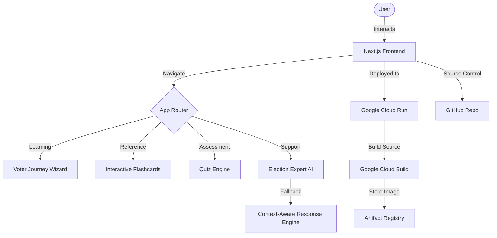

# 🗳️ BharatVote | Interactive Election Portal

BharatVote is a premium, state-of-the-art web application designed to educate and empower Indian citizens about the electoral process. It combines modern UI/UX with interactive educational tools and an AI-driven assistant to provide a comprehensive guide to the world's largest democracy.

## 🌟 Features

- **Interactive Voter Journey**: A step-by-step guide through the electoral process, from registration to casting a vote.
- **AI-Powered Election Assistant**: A specialized AI interface that answers complex queries about government formation, constitutional procedures, and electoral laws.
- **Educational Flashcards**: Master electoral terminology (EVM, VVPAT, MCC, etc.) through high-quality interactive cards.
- **Knowledge Quizzes**: Test your understanding of the democratic process with gamified assessments.
- **Premium Design System**: A responsive, high-performance interface featuring Indian flag-inspired aesthetics, smooth animations (Framer Motion), and glassmorphism effects.

## 🏗️ Architecture & Workflow



## 🛠️ Tech Stack

- **Framework**: Next.js 15 (App Router)
- **Styling**: TailwindCSS
- **Animations**: Framer Motion
- **Icons**: Lucide React
- **Deployment**: Google Cloud Run
- **CI/CD**: Google Cloud Build & Artifact Registry

## 🚀 Deployment Info

The project is containerized using Docker and deployed to Google Cloud Run.

- **Production URL**: [https://bharat-vote-517202348101.us-central1.run.app](https://bharat-vote-517202348101.us-central1.run.app)
- **Region**: us-central1
- **Project ID**: prompt1-494714

## 📖 Getting Started

First, install dependencies:
```bash
npm install
```

Run the development server:
```bash
npm run dev
```

Build for production:
```bash
npm run build
```

---
*Built to educate and empower. Not officially affiliated with the Election Commission of India.*
